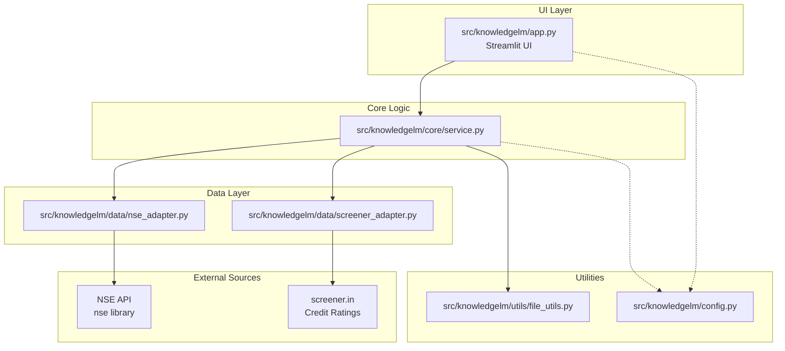
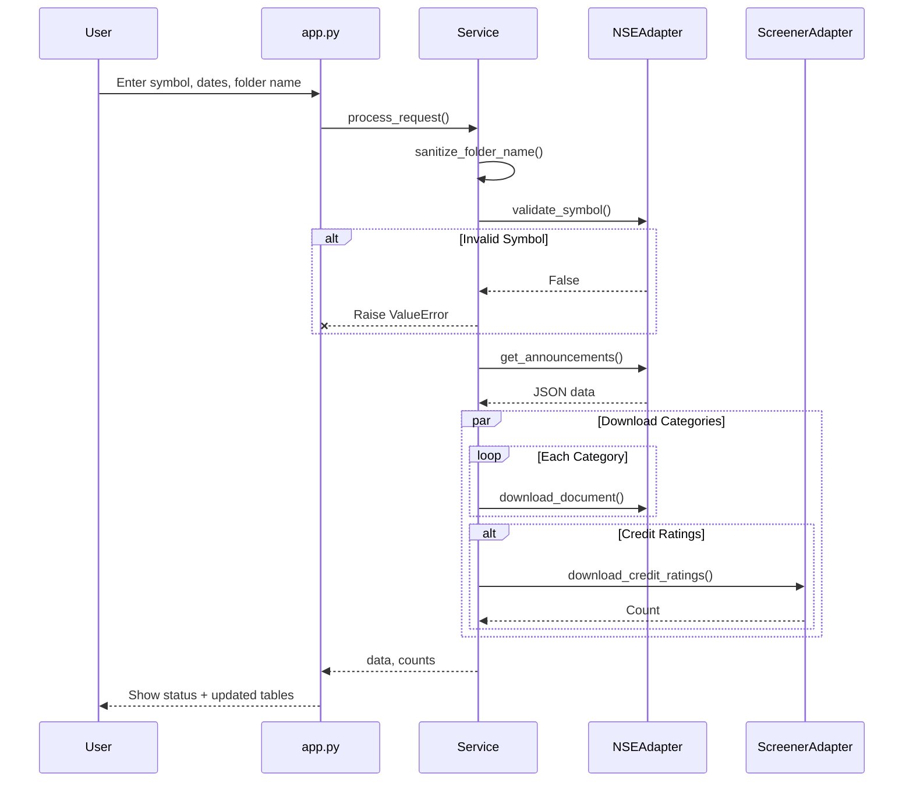

# Architecture

## Module Structure



## Project Structure

```
KnowledgeLM/
├── src/
│   └── knowledgelm/
│       ├── __init__.py
│       ├── app.py               # Streamlit UI
│       ├── config.py            # Configuration
│       ├── core/
│       │   └── service.py       # Orchestration Logic
│       ├── data/
│       │   ├── nse_adapter.py   # NSE Library Wrapper
│       │   └── screener_adapter.py # Screener Scraper
│       └── utils/
│           └── file_utils.py    # Sanitization & paths
├── tests/
│   └── test_placeholder.py
├── .context/
├── pyproject.toml               # uv/pip config
└── README.md
```

## Component Responsibilities

### app.py
- **UI**: Streamlit forms for symbol, dates, category selection.
- **Display**: Renders status and download tables.
- **Validations**: Calls `KnowledgeService`.

### core/service.py
- **`KnowledgeService`**: Orchestrates fetching and downloading.
- **Filters**: Applies business logic (category filters) on fetched data.

### data/
- **`nse_adapter.py`**: Wraps the external `nse` library.
  - **Validation**: Checks symbol validity via `equityQuote`.
- **`screener_adapter.py`**: Handles scraping from Screener.in.
  - Resolves ICRA PDF links directly.
  - Uses Selenium for high-fidelity HTML-to-PDF conversion.

### utils/file_utils.py
- **`sanitize_folder_name`**: Prevents path traversal security issues.

## Data Flow



## Output Structure

```
{folder_name}/
├── transcripts/
├── investor_presentations/
├── credit_rating/
├── related_party_txns/
├── annual_reports/
├── resignations/      (Optional: Logical grouping in UI, physical folder relies on user download)
├── updates/           (Optional: Logical grouping in UI)
└── press_releases/    (Optional: Logical grouping in UI)
```
