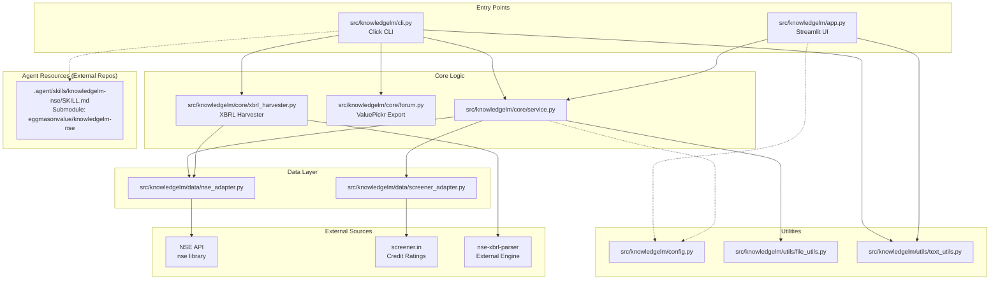
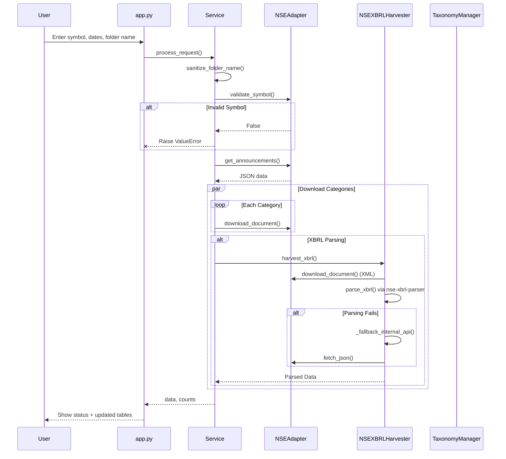

# Architecture

## Module Structure


```mermaid
graph TD
    subgraph Entry["Entry Points"]
        CLI[src/knowledgelm/cli.py<br/>Click CLI]
        APP[src/knowledgelm/app.py<br/>Streamlit UI]
    end

    subgraph Logic["Core Logic"]
        SRV[src/knowledgelm/core/service.py]
        FORUM[src/knowledgelm/core/forum.py<br/>ValuePickr Export]
        XBRL[src/knowledgelm/core/xbrl_harvester.py<br/>XBRL Harvester]
    end

    subgraph Data["Data Layer"]
        NSE_ADPT[src/knowledgelm/data/nse_adapter.py]
        SCR_ADPT[src/knowledgelm/data/screener_adapter.py]
    end

    subgraph Agent["Agent Resources (External Repos)"]
        SKILL[.agent/skills/knowledgelm-nse/SKILL.md<br/>Submodule: eggmasonvalue/knowledgelm-nse]
    end

    subgraph Utils["Utilities"]
        CONF[src/knowledgelm/config.py]
        F_UTIL[src/knowledgelm/utils/file_utils.py]
        T_UTIL[src/knowledgelm/utils/text_utils.py]
    end


    subgraph External["External Sources"]
        NSE_LIB[NSE API<br/>nse library]
        SCR_WEB[screener.in<br/>Credit Ratings]
        NSE_XBRL_PARSER[nse-xbrl-parser<br/>External Engine]
    end

    CLI --> SRV
    CLI --> FORUM
    CLI --> XBRL
    APP --> SRV
    SRV --> NSE_ADPT
    SRV --> SCR_ADPT
    SRV --> F_UTIL
    XBRL --> NSE_ADPT
    NSE_ADPT --> NSE_LIB
    XBRL --> NSE_XBRL_PARSER
    SCR_ADPT --> SCR_WEB
    CLI .-> SKILL
    APP ..-> CONF
    SRV ..-> CONF
    CLI --> T_UTIL
    APP --> T_UTIL

```

## Project Structure

```
KnowledgeLM/
├── src/
│   └── knowledgelm/
│       ├── __init__.py
│       ├── cli.py                # Click CLI (v3.0)
│       ├── app.py                # Streamlit UI
│       ├── config.py             # Configuration
│       ├── core/
│       │   ├── service.py        # Orchestration Logic
│       │   ├── forum.py          # ValuePickr Logic
│       │   └── xbrl_harvester.py # XBRL Orchestration (via nse-xbrl-parser)
│       ├── data/
│       │   ├── nse_adapter.py    # NSE Library Wrapper
│       │   └── screener_adapter.py # Screener Scraper
│       └── utils/
│           ├── file_utils.py     # Sanitization & paths
│           └── text_utils.py     # Pluralization & formatting

├── tests/
│   ├── conftest.py
│   ├── test_cli.py
│   ├── test_forum.py
│   ├── test_nse_adapter.py
│   ├── test_screener_adapter.py
│   ├── test_service.py
│   ├── test_utils.py
│   └── test_xbrl_arelle.py
├── .agent/
│   └── skills/
│       └── knowledgelm-nse/      # Git Submodule (External Repo)
│           └── SKILL.md          # Agent Skill (v3.0)
├── .context/
├── pyproject.toml                # uv config
└── README.md
```

## [done] CLI Interface (v3.0)

Full programmatic access via `knowledgelm` command:
- **Universal Fetch**: Batch download and XBRL extraction handled via `fetch nse`. Forum downloads via `fetch vp`.
- **Discovery**: `list-datasets` allows the agent to build the configuration dynamically.
- **JSON Output**: CLI natively produces JSON for machine readability and AI agent parsing.
- **Help Discovery**: `--help` on all commands for agent self-discovery.

## Component Responsibilities

### cli.py
- **CLI**: Click-based universal `fetch` interface.
- **XBRL Support**: Passed dynamically as datasets to the overarching API.
- **JSON Default**: All commands print exclusively valid JSON object strings to stdout.
- **Help Discovery**: Instructs agents to use standard `--help` traversal.

### app.py
- **UI**: Premium card-based layout (`st.container(border=True)`) with a strictly aligned **4x3 checkbox grid**.
    - Logical grouping preserves "separation of concerns" with XBRL categories in the rightmost column.
- **UX**: Integrates a JavaScript trigger for automatic smooth-scrolling to the success banner upon download completion.
- **Validations**: Calls `KnowledgeService` for bulk processing.

### core/service.py
- **`KnowledgeService`**: Orchestrates fetching and downloading.
- **Filters**: Applies business logic (category filters) on fetched data.
- **Resilience**:
    - **URL Filtering**: Automatically skips invalid NSE placeholder URLs (e.g., terminating in `/-`).
    - **Tightened Matching**: Uses significant-substring matching to prevent false positives in issue documents (e.g., avoiding "Bank of India" for "SBIN").

### core/xbrl_harvester.py
- **`NSEXBRLHarvester`**: Fetches and parses XBRL filings from NSE.
- **External Parsing Engine**: Delegates the heavy lifting of taxonomy resolution and absolute path rewriting to the `nse-xbrl-parser` package to limit execution time and complexity in the KnowledgeLM core base.
- **Fallback Mechanism**: Degrades gracefully to use NSE's internal API (raw keys) with prominent logging if parser fails.

### XBRL Announcement Harvester

The `NSEXBRLHarvester` provides granular, field-level parsing of corporate announcements (e.g., personnel changes). <!-- , board outcomes). -->

- **Standardized Flow**: XBRL categories are integrated into the main `process_request` flow.
- **Persistence**: Detailed parsed data is saved as `xbrl_details.json` within the symbol's filing folder.
- **Client Access**: The CLI returns concise metadata (stat and local path) to prevent token bloat, while the UI displays the parsed data in interactive tables.

### data/
- **`nse_adapter.py`**: Wraps the external `nse` library.
  - **Validation**: Checks symbol validity via `equityQuote`.
  - **Consolidated Download**: `download_and_extract` provides a unified, robust mechanism for both direct file downloads and recursive ZIP extraction.
  - **Issue Documents**: Fetches NSE corporate filing endpoints via `_req`.
  - **Generic Fetching**: Exposes `fetch_json` to support XBRL harvesting and taxonomy management.
- **`screener_adapter.py`**: Handles scraping from Screener.in.
  - Resolves ICRA PDF links directly.
  - Uses Selenium for high-fidelity HTML-to-PDF conversion.

### .agent/skills/knowledgelm-nse/
- **`SKILL.md`**: Agent skill following [Agent Skills](https://agentskills.io) standard.
  - Instructs AI agents on CLI usage and NotebookLM integration.
  - Self-upgradeable via GitHub raw URL.

### utils/file_utils.py
- **`sanitize_folder_name`**: Prevents path traversal security issues.

### utils/text_utils.py
- **`pluralize`**: Centralized pluralization engine used by both CLI and UI for professional output formatting (e.g., "1 PDF" vs "2 PDFs").


## Context Management Strategy

Given the **Agent-First** nature of the codebase, a core architectural requirement is the preservation of the LLM context window:

1.  **I/O Isolation**: The CLI (`src/knowledgelm/cli.py`) is the only component allowed to output to the terminal. All other layers must remain silent.
2.  **Redirected Logs**: Any accidental output or third-party library noise (e.g., from `nse` or Selenium) is intercepted and redirected to `knowledgelm.log`.
3.  **Clean Signal**: Command results are provided as structured data (JSON) only when explicitly requested. This ensures the agent is not overwhelmed by verbose progress bars or debugging text.
4.  **Bubbled Exceptions**: Functional logic uses standard Python exceptions which are caught at the entry point to decide the exit code and log the failure, rather than printing to `stderr`.

## Data Flow


```mermaid
sequenceDiagram
    participant U as User
    participant A as app.py
    participant S as Service
    participant N as NSEAdapter
    participant X as NSEXBRLHarvester
    participant T as TaxonomyManager

    U->>A: Enter symbol, dates, folder name
    A->>S: process_request()
    S->>S: sanitize_folder_name()

    S->>N: validate_symbol()
    alt Invalid Symbol
        N-->>S: False
        S--x A: Raise ValueError
    end

    S->>N: get_announcements()
    N-->>S: JSON data

    par Download Categories
        loop Each Category
             S->>N: download_document()
        end
        alt XBRL Parsing
             S->>X: harvest_xbrl()
             X->>N: download_document() (XML)
             X->>X: parse_xbrl() via nse-xbrl-parser
             alt Parsing Fails
                X->>X: _fallback_internal_api()
                X->>N: fetch_json()
             end
             X-->>S: Parsed Data
        end
    end

    S-->>A: data, counts
    A-->>U: Show status + updated tables
```

## Output Structure

```
{symbol}_sources/
├── transcripts/
├── investor_presentations/
├── credit_rating/
├── related_party_txns/
├── annual_reports/
├── personnel_changes.json         (Parsed XBRL data)
├── key_announcements.json         (Parsed XBRL data)
├── share_issuance_docs/
├── shareholder_meetings/
│     ├── shm_notices/
│     └── shm_details.json         (Parsed XBRL data)
├── press_releases/
└── forum_valuepickr/
      ├── forum_thread.pdf
      └── forum_links.md

```
