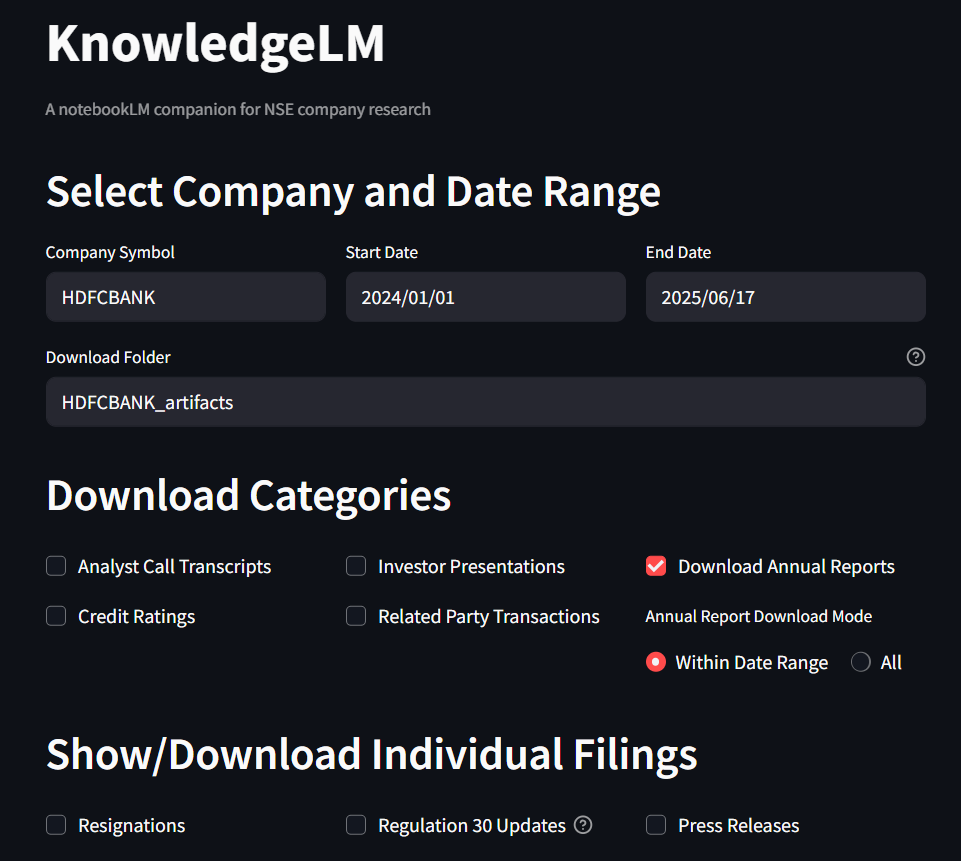
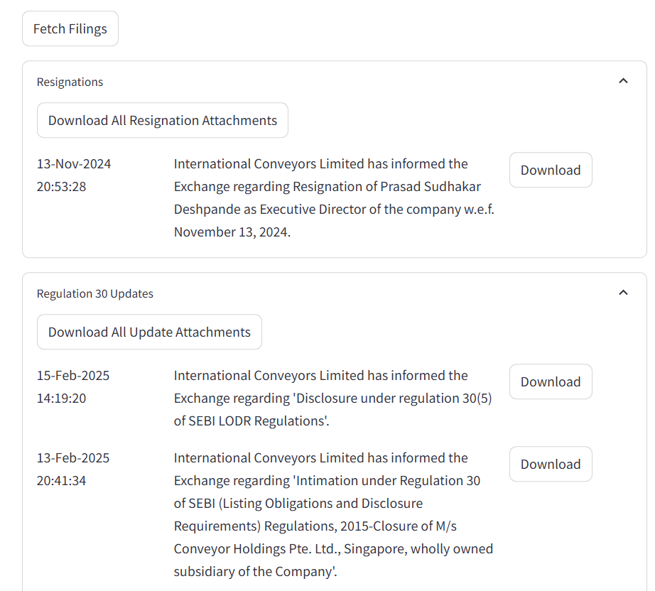

# KnowledgeLM

A web app to batch download NSE company announcements by category.  
Intended as a companion for NotebookLM and other research tools.

## Features

- Download announcements and attachments by category (Transcripts, Investor Presentations, Credit Rating, Related Party Transactions, Annual Reports).
- View and download attachments for Resignations, Regulation 30 Updates (experimental), and Press Releases in collapsible windows.
- "Download all" and per-filing download options for each window.
- Option to download all annual reports or within a date range
- Select company, date range, and download folder (created in the current directory if it does not exist).
- User-friendly UI with status window and progress feedback.

## Screenshots

Below are some screenshots of the application in action:





## Usage

1. Enter the company symbol, start date, and end date.
2. Choose the download folder (it will be created in the current directory if it does not exist).
3. Select download categories and/or which filings to display.
4. Click "Fetch Filings" to download the data under the Downloads category and show filings under the Show category.
5. Use the collapsible windows to view and download the show category's attachments.


## Value proposition
**Batch download:** NSE doesn't have limits on the from and to date ranges(unlike BSE) but it lacks the option to batch download documents or choose multiple categories.
**Filtering:** Both NSE and BSE have a lot of phantom categories and subcategories making it difficult to filter

## Requirements

- Python 3.8+
- streamlit
- pandas
- requests

## Installation

Install all requirements using:

```sh
pip install -r requirements.txt
```

Or install the main dependencies individually:

```sh
pip install streamlit pandas nse pathlib
```

## How to Run

```sh
streamlit run app.py
```
